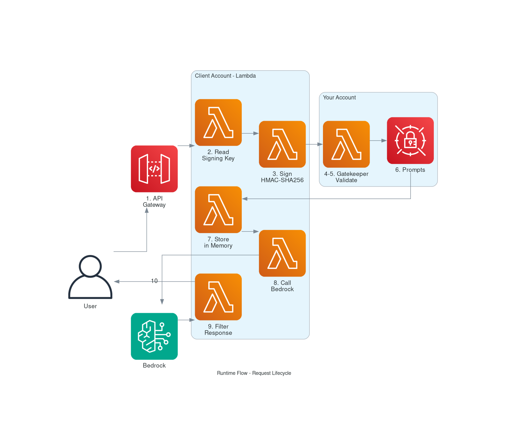
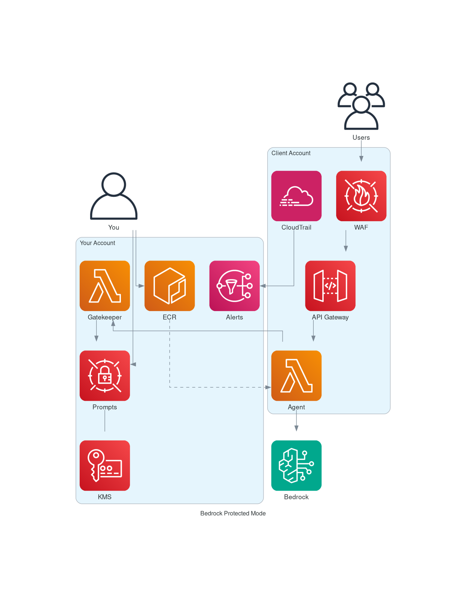

# Bedrock Protected Mode

> Deploy AI agents in customer accounts while keeping your prompts completely protected.

---

# 🎯 The Problem

You want to sell an AI agent to enterprise customers. But there's a conflict:

| Requirement | Why |
| --- | --- |
| Agent MUST run in customer's AWS account | Data residency, compliance, security policies |
| Prompts MUST NOT be visible to customer | They are your intellectual property (IP) |

> ⚠️ **Native Bedrock Agents don't solve this** — prompts are visible in the AWS Console to anyone with account access.

---

# 💡 The Solution

Split the deployment across **two AWS accounts**:

## Your Account (Central)

| Component | Purpose |
| --- | --- |
| Secrets Manager | Store prompts (KMS encrypted) |
| Lambda Gatekeeper | Validate HMAC-SHA256 signatures |
| ECR | Host container image (restricted access) |
| KMS | Encryption key for secrets |

## Client Account

| Component | Purpose |
| --- | --- |
| Lambda | Run AI agent container |
| API Gateway | Public endpoint + API key + rate limiting |
| WAF | Firewall and request filtering |
| CloudTrail | Audit logging → alerts to your account |

> ✅ **Key insight**: The client can run your agent but cannot see your prompts.

---

# 🔐 Why It's Secure

## 1. Prompts Never Leave Your Account (at rest)

- Prompts stored in **your** Secrets Manager
- Encrypted with **your** KMS key
- Fetched over HTTPS at runtime
- Stored **only in memory** during Lambda execution
- Never written to disk, logs, or environment variables

## 2. Cryptographic Access Control

Every request to fetch prompts must be signed with **HMAC-SHA256**:

| Field | Value |
| --- | --- |
| Algorithm | HMAC-SHA256 |
| Message | `timestamp + account_id` |
| Key | Signing key (embedded in container) |

The Gatekeeper validates:
- ✓ Signature matches
- ✓ Timestamp within 5 minutes (replay protection)
- ✓ Account ID is authorized

> 🚫 Without the signing key → **403 Forbidden**

## 3. Container Image Protection

ECR policy restricts who can pull the image:

| Who | Can pull? |
| --- | --- |
| Lambda execution role | ✅ Yes (automated) |
| Client admin user | ❌ Access Denied |
| Client admin role | ❌ Access Denied |
| Anyone else | ❌ Access Denied |

## 4. Multi-Stage Docker Build

The signing key is hidden from `docker history`:

```dockerfile
# Stage 1: Create key (DISCARDED after build)
FROM alpine AS secrets
RUN echo "${SIGNING_KEY}" > /secrets/.signing_key

# Stage 2: Final image (key copied, command hidden)
FROM public.ecr.aws/lambda/python:3.12
COPY --from=secrets /secrets/.signing_key /var/task/.signing_key
```

If someone runs `docker history`:
```
COPY /secrets/.signing_key /var/task/.signing_key
```

> 🔒 The actual key value **never appears** in any layer metadata.

---

# 🛡️ Attack Scenarios

| Attack Vector | Result | Why |
| --- | --- | --- |
| Read Secrets Manager directly | ❌ Access Denied | Wrong account |
| `docker pull` from ECR | ❌ Access Denied | Restricted policy |
| `docker history` | ❌ No key visible | Multi-stage build |
| Read Lambda env vars | ❌ Nothing there | Key embedded in image |
| Call Gatekeeper directly | ❌ 403 Forbidden | No valid signature |
| Inspect Lambda code | ❌ Not possible | Lambda isolation |
| Memory dump | ❌ Not possible | AWS security boundary |
| Man-in-the-middle | ❌ HTTPS + signature | Can't forge requests |

---

# 🔄 The Complete Flow

## Setup Phase (One time)

### Step 1: Write Prompts
```
prompts/
├── system.txt
└── instruction.txt
```
Run `terraform apply` → Secrets Manager (KMS encrypted)

### Step 2: Build Container
```bash
docker build --build-arg SIGNING_KEY=xxx -t agent .
docker push <ECR_URL>
```

---

## Runtime Phase (Every request)

| Step | Action | Location |
| --- | --- | --- |
| 1 | User sends request | → API Gateway |
| 2 | Lambda reads signing key | Client Account |
| 3 | Lambda signs request (HMAC-SHA256) | Client Account |
| 4 | Request sent to Gatekeeper | → Your Account |
| 5 | Gatekeeper validates signature | Your Account |
| 6 | Gatekeeper returns prompts | → Client Account |
| 7 | Lambda stores prompts in memory | Client Account |
| 8 | Lambda calls Bedrock | Client Account |
| 9 | Lambda filters response for leakage | Client Account |
| 10 | Response returned to user | ← API Gateway |



---

# 🏗️ Architecture



---

# 🧅 Security Layers

| Layer | Protection |
| --- | --- |
| 1. Network | WAF → API Gateway → Lambda (no direct access) |
| 2. Authentication | API Key required for /invoke |
| 3. Cryptographic | HMAC-SHA256 signed requests |
| 4. Encryption | KMS encryption at rest |
| 5. Isolation | Cross-account IAM boundaries |
| 6. Monitoring | CloudTrail → EventBridge → SNS alerts |

---

# 🧪 Quick Demo

## Configuration
```bash
BASE_URL=https://tfu6l3205j.execute-api.us-east-1.amazonaws.com
API_KEY=sk-bedrock-protected-demo-2024-secure-key
```

## Health Check
```bash
curl -s $BASE_URL/health | jq .
```

## List Tools
```bash
curl -s $BASE_URL/tools | jq .
```

## Invoke Agent
```bash
curl -s -X POST $BASE_URL/invoke \
  -H 'Content-Type: application/json' \
  -H "X-API-Key: $API_KEY" \
  -d '{"message": "Calculate 15 * 7", "session_id": "demo"}' | jq .
```

**Response:**
```json
{
  "response": "The result is 105.",
  "session_id": "demo"
}
```

---

# 💰 Cost Estimate

| Usage | Monthly Cost |
| --- | --- |
| Idle | ~$2.50 |
| Light (1K calls) | ~$3 |
| Medium (10K calls) | ~$5 |
| Heavy (100K calls) | ~$25 |

> 💡 **Lambda scales to zero** — you only pay when the agent is used.

---

# ✅ Conclusion

**Bedrock Protected Mode** allows you to:

- ✅ Deploy AI agents in customer AWS accounts
- ✅ Keep your prompts completely protected
- ✅ Maintain cryptographic control over your IP
- ✅ Scale to zero when not in use
- ✅ Monitor all access attempts

---

> 🔐 **Your prompts are your IP. Keep them protected.**
